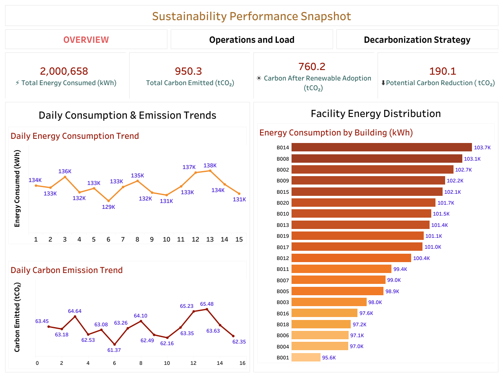

# Enterprise Energy & Carbon Optimization Dashboard
## Project Overview

This project analyzes enterprise energy consumption across multiple buildings to identify operational inefficiencies and opportunities to reduce carbon emissions.

Using Python, SQ and Tableau, the project explores energy usage patterns, occupancy behavior and hourly load trends to provide actionable sustainability insights.

The final deliverable is an interactive dashboard that helps decision-makers understand energy consumption patterns and prioritize carbon reduction strategies.

___

## Business Problem

Organizations operating multiple facilities often struggle to monitor energy consumption and carbon emissions effectively. Without clear visibility into how energy is being used across buildings and time periods, it becomes difficult to identify operational inefficiencies or prioritize sustainability initiatives.

Key questions the organization needs to answer include:

- Which buildings consume the most energy?
- When does peak energy demand occur?
- Does energy consumption align with building occupancy levels?
- Which facilities should be prioritized for carbon reduction initiatives?

Without answering these questions, organizations may face increasing energy costs and difficulty meeting sustainability or ESG goals.

___

## Project Objective

The objective of this project is to analyze enterprise energy consumption data and identify opportunities to improve operational efficiency and reduce carbon emissions.

The analysis focuses on:

- Understanding the organization's energy consumption patterns
- Identifying operational inefficiencies related to occupancy and load patterns
- Estimating carbon emissions based on electricity usage
- Evaluating the potential impact of renewable energy adoption
- Highlighting buildings with the highest potential for carbon reduction

The final outcome is an interactive Tableau dashboard that provides actionable insights for energy optimization and sustainability decision-making.

___

## Dataset Description

The dataset contains hourly energy consumption data for multiple buildings within an organization. Each record represents energy usage and environmental conditions at a specific timestamp.

The dataset includes operational and environmental attributes that allow analysis of energy consumption patterns across buildings and time.

### Key Features

| Column Name | Description |
|-------------|-------------|
| Timestamp | Date and time of energy measurement |
| Building_ID | Unique identifier for each building |
| Energy_Usage_kWh | Energy consumption measured in kilowatt-hours |
| Temperature_C | Ambient temperature in Celsius |
| Humidity | Relative humidity percentage |
| Building_Type | Category of building (Industrial, Commercial, Educational, Residential) |
| Occupancy_Level | Occupancy classification (Low, Medium, High) |

### Engineered Features

Additional analytical features were created during the data preparation stage:

| Feature | Description |
|--------|-------------|
| Year | Extracted from timestamp |
| Month | Extracted from timestamp |
| Day | Extracted from timestamp |
| Hour | Hour of the day for load analysis |
| Weekday | Day of the week |
| Is_Weekend | Indicator for weekend vs weekday |
| Carbon_Emission_kg | Estimated carbon emissions from electricity usage |
| Adjusted_Carbon_kg | Carbon emissions after renewable energy simulation |

___

## Tools & Technologies

The following tools and technologies were used throughout the project:

- **Python (Pandas, NumPy)** – Data cleaning, exploration, and feature engineering
- **SQL (MySQL)** – Data aggregation and analytical queries
- **Tableau** – Interactive dashboard development and visualization
- **Jupyter Notebook** – Data analysis and documentation
- **GitHub** – Project version control and documentation

___

## Project Workflow

The project follows an end-to-end data analytics workflow covering data preparation, analysis and visualization.

### 1. Data Preparation (Python)

The dataset was first analyzed and cleaned using Python and Pandas. This stage involved:

- Loading and exploring the dataset
- Checking for missing values and incorrect data types
- Converting timestamps into usable time features such as hour, day and weekday
- Creating additional analytical features including carbon emission estimates
- Simulating renewable energy adoption to estimate carbon reduction potential

The processed dataset was then exported for further analysis.

---

### 2. Data Analysis (SQL)

SQL was used to perform analytical queries and identify operational patterns in the data.

Key analyses included:

- Total energy consumption by building
- Carbon emissions by building type
- Average energy consumption by occupancy level
- Hourly load pattern analysis to identify peak demand hours
- Facility-level benchmarking of energy usage

These queries helped uncover operational inefficiencies and demand patterns.

---

### 3. Data Visualization (Tableau)

Finally, Tableau was used to build an interactive dashboard that communicates the insights effectively.

The dashboard is organized into three sections:

- **Executive Sustainability Overview** – summarizes total energy consumption and carbon emissions
- **Operational Efficiency & Load Behavior** – analyzes energy usage by occupancy level, building type and hourly demand patterns
- **Decarbonization Strategy** – highlights buildings with the highest emissions and evaluates renewable energy impact

The dashboard enables stakeholders to explore energy usage patterns and prioritize sustainability initiatives.

___

## Dashboard Preview

### Executive Overview


### Operational Efficiency Analysis


### Decarbonization Strategy


___

## Key Insights

The analysis revealed several important patterns in energy consumption and carbon emissions across the organization.

### 1. Industrial Buildings Drive Energy Consumption
Industrial facilities account for the largest share of total energy usage and carbon emissions. This indicates that these facilities should be prioritized for energy optimization and renewable adoption initiatives.

### 2. Energy Usage Remains High During Low Occupancy
Energy consumption remains relatively high even during low occupancy periods. This suggests the presence of base-load energy usage that does not scale with building utilization, highlighting potential opportunities for operational efficiency improvements.

### 3. Evening Hours Show Peak Energy Demand
Hourly load analysis revealed that peak energy demand occurs during evening hours. This has implications for renewable energy planning, as solar generation may not fully align with peak demand without energy storage solutions.

### 4. Renewable Adoption Can Reduce Carbon Emissions
Simulation of renewable energy adoption shows that the organization could potentially reduce total carbon emissions by approximately 20 percent.

### 5. Carbon Reduction Potential Varies Across Buildings
Some buildings contribute significantly more to carbon emissions than others. Prioritizing renewable energy implementation in these high-impact facilities would maximize emission reduction.

___

## Recommendations

Based on the insights from the analysis, several actions can help improve energy efficiency and reduce carbon emissions:

1. **Prioritize Renewable Energy for High-Consumption Buildings**

   Industrial facilities contribute the largest share of energy usage and emissions. Deploying renewable energy sources such as solar panels at these locations would generate the highest carbon reduction impact.

2. **Optimize Energy Usage During Low Occupancy**

   Buildings showing high energy consumption during low occupancy periods should implement energy management strategies such as automated lighting, HVAC optimization and smart building systems.

3. **Implement Energy Storage or Demand-Shifting**

   Peak demand occurs during evening hours. Energy storage solutions or demand-shifting strategies could help balance renewable generation and peak consumption.

4. **Establish Continuous Energy Monitoring**

   Implementing real-time energy monitoring dashboards can help facility managers track energy consumption and identify inefficiencies early.

___

## Business Impact

## Business Impact

If implemented, the insights from this analysis could deliver measurable sustainability and operational benefits:

- **~20% reduction in carbon emissions**  
  Renewable energy adoption could reduce total emissions from **950 tCO₂ to approximately 760 tCO₂**, resulting in a potential reduction of **~190 tCO₂** over the analyzed period.

- **Targeted optimization of high-impact facilities**  
  The analysis identified the **top energy-consuming buildings (e.g., B014, B008, B002)**, each exceeding **100,000 kWh** of energy usage. Prioritizing efficiency improvements or renewable deployment in these facilities could generate the greatest emission reduction impact.

- **Improved operational energy efficiency**  
  Energy consumption remained nearly **evenly distributed across occupancy levels (~33% each)**, indicating potential base-load inefficiencies. Addressing these inefficiencies through automation and optimized building management systems could reduce unnecessary energy consumption.

- **Better demand management strategies**  
  Hourly load analysis revealed **evening peak demand between 20:00–22:00**, enabling organizations to evaluate **energy storage or demand-shifting strategies** to manage peak electricity usage more effectively.

- **Data-driven sustainability planning**  
  The integrated dashboard enables leadership to monitor energy consumption, benchmark facilities and evaluate decarbonization scenarios, supporting **data-driven energy management and ESG reporting**.

___

## Conclusion

This project demonstrates how data analytics can be used to understand enterprise energy consumption patterns and support sustainability initiatives.

By combining Python for data preparation, SQL for analytical querying and Tableau for visualization, the project transforms raw operational data into actionable insights.

The dashboard helps identify high-consumption buildings, understand peak demand behavior, and evaluate the potential impact of renewable energy adoption. These insights can support organizations in improving energy efficiency and progressing toward carbon reduction goals.

___

## Repository Structure

```
energy-carbon-optimization-dashboard
│
├── data  
│   ├── raw_data  
│   └── processed_data  
│
├── notebooks  
│   └── energy_analysis.ipynb  
│
├── sql  
│   └── energy_analysis_queries.sql  
│
├── tableau  
│   └── energy_carbon_dashboard.twbx  
│
├── images  
│   ├── dashboard_overview.png  
│   ├── operational_analysis.png  
│   └── decarbonization_strategy.png  
│
├── README.md  
```


